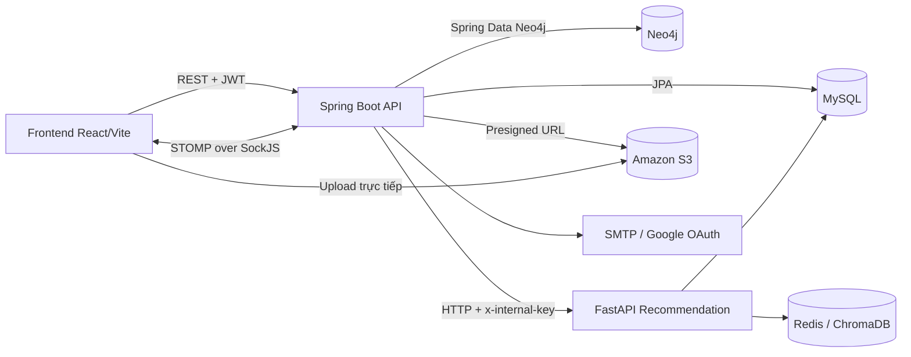

<div align="center">

  <h1>🎓 Garnet - Backend</h1>

  <hr />

  <h3>Hệ thống mạng xã hội học thuật dành cho sinh viên</h3>

  <p>
    Garnet cung cấp REST API và kết nối WebSocket cho nền tảng Garnet,<br />
    nơi sinh viên chia sẻ kiến thức, kết nối cộng đồng và tương tác theo thời gian thực.
  </p>

  <p>
    
    
    
    
  </p>

  <p>
    
    
    
  </p>

</div>

## Tính năng nổi bật

- Đăng ký, đăng nhập bằng email/mật khẩu và Google OAuth 2.0.
- Xác thực stateless bằng JWT với access token và refresh token trong HttpOnly cookie.
- Quên mật khẩu, đặt lại mật khẩu qua email.
- Tạo, xem, chia sẻ và xóa bài viết; hỗ trợ ảnh, video, tag và bài viết trong nhóm.
- Bảng tin trang chủ, theo topic và theo group được cá nhân hóa bởi recommendation service.
- Bình luận nhiều cấp, like/dislike bài viết và bình luận.
- Theo dõi, bỏ theo dõi, chặn người dùng, tìm kiếm và gợi ý kết nối.
- Tạo và quản lý nhóm: yêu cầu tham gia, duyệt/từ chối thành viên, rời nhóm và quản lý nội dung nhóm.
- Chat riêng và thông báo thời gian thực qua STOMP over SockJS.
- Upload media trực tiếp lên Amazon S3 bằng presigned URL.
- Báo cáo bài viết, bình luận, nhóm và quy trình kiểm duyệt dành cho quản trị viên.
- Dashboard quản trị, quản lý tài khoản, nội dung và báo cáo vi phạm.
- Đồng bộ dữ liệu quan hệ sang Neo4j bằng hàng đợi sự kiện để phục vụ gợi ý và truy vấn đồ thị.

## Tech stack

### Thành phần trong repository

| Thành phần | Công nghệ | Vai trò |
|---|---|---|
| Ngôn ngữ | Java 21 | Ngôn ngữ chính của backend |
| Framework | Spring Boot 4.0.5 | Khởi tạo và vận hành ứng dụng |
| REST API | Spring Web MVC | Cung cấp HTTP API |
| Bảo mật | Spring Security, JWT, BCrypt | Xác thực và phân quyền |
| ORM | Spring Data JPA, Hibernate | Truy cập dữ liệu quan hệ |
| Graph | Spring Data Neo4j | Truy cập dữ liệu đồ thị |
| Cơ sở dữ liệu chính | MySQL | Lưu dữ liệu nghiệp vụ |
| Cơ sở dữ liệu đồ thị | Neo4j | Lưu quan hệ người dùng, bài viết, nhóm và sở thích |
| Real-time | Spring WebSocket, STOMP, SockJS | Chat và thông báo thời gian thực |
| Media | AWS SDK for Java, Amazon S3 | Sinh presigned URL và lưu ảnh/video |
| Email | Spring Mail | Gửi email đặt lại mật khẩu |
| OAuth | Spring OAuth2 Client | Đăng nhập Google |
| Build | Maven Wrapper | Quản lý dependency và đóng gói ứng dụng |
| Container | Docker, Docker Compose | Build và chạy Spring Boot API |

### Các thành phần triển khai độc lập

- Frontend React/Vite gọi REST API và kết nối WebSocket tới backend.
- Recommendation service viết bằng FastAPI cung cấp danh sách ID bài viết được cá nhân hóa.
- Redis Cloud và ChromaDB Cloud thuộc hạ tầng của recommendation service, không được khởi tạo bởi repository này.
- MySQL và Neo4j có thể chạy local hoặc sử dụng dịch vụ cloud như Aiven MySQL và Neo4j Aura.

## Kiến trúc hệ thống



Backend được tổ chức theo kiến trúc phân lớp:

```text
HTTP/WebSocket request
        ↓
Controller          Nhận request, validation và phân quyền
        ↓
Service             Xử lý nghiệp vụ và transaction
        ↓
Repository          Truy cập MySQL hoặc Neo4j
        ↓
Response DTO        Trả dữ liệu ổn định cho client
```

MySQL là nguồn dữ liệu nghiệp vụ chính. Khi có thay đổi liên quan đến user, post, group, follow, reaction hoặc comment, backend ghi sự kiện đồng bộ vào MySQL. `Neo4jSyncScheduler` lấy các sự kiện đang chờ theo lô và cập nhật Neo4j định kỳ.

Đối với bảng tin, Spring gọi recommendation service để lấy danh sách ID bài viết theo thứ tự gợi ý, sau đó truy vấn đầy đủ bài viết và media từ MySQL. Nếu dịch vụ gợi ý timeout hoặc không khả dụng, backend dùng truy vấn MySQL làm phương án dự phòng.

## Cấu trúc thư mục

```text
src/main/java/com/example/garet/
├── components/       JWT provider và security handlers
├── configurations/   Security, JPA, Neo4j, S3, WebSocket, scheduler
├── controllers/
│   ├── auth/         Xác thực và Google OAuth
│   ├── users/        API dành cho người dùng
│   ├── admin/        API dành cho quản trị viên
│   ├── metadata/     Danh mục ngành học, tag và sở thích
│   └── system/       Ghi nhận hoạt động hệ thống
├── dtos/             Request DTO và payload nội bộ
├── enums/            Trạng thái và loại nghiệp vụ
├── events/           Application event và notification listener
├── exceptions/       Exception nghiệp vụ và global exception handler
├── filter/           JWT authentication filter
├── models/
│   ├── jpa/          Entity MySQL
│   └── neo4j/        Node Neo4j
├── repositories/
│   ├── jpa/          Repository MySQL
│   └── neo4j/        Repository Neo4j
├── responses/        Response DTO và cấu trúc phân trang
├── scheduled/        Tiến trình đồng bộ nền
└── services/         Nghiệp vụ ứng dụng và tích hợp dịch vụ ngoài
```

### Định dạng response

Response thông thường được bọc trong cấu trúc:

```json
{
  "success": true,
  "data": {},
  "error": null
}
```

Khi có lỗi:

```json
{
  "success": false,
  "data": null,
  "error": "Nội dung lỗi"
}
```

Feed bài viết sử dụng cursor pagination:

```json
{
  "items": [],
  "pageSize": 20,
  "nextCursor": "cursor-cua-trang-ke-tiep",
  "hasNext": true
}
```

Client gửi lại `nextCursor` qua query parameter `cursor`. Một số danh sách quản trị, thành viên, chat và thông báo sử dụng phân trang theo `page` và `size`.

### WebSocket

- SockJS endpoint: `/ws`
- STOMP broker destinations: `/topic`, `/queue`
- User destinations:
  - `/user/queue/message`: tin nhắn mới
  - `/user/queue/chat.read`: biên nhận đã đọc
  - `/user/queue/notifications`: thông báo mới

Khi STOMP `CONNECT`, client gửi JWT trong native header `Authorization: Bearer <access-token>`. Tin nhắn được tạo qua REST API `POST /users/chat/send/{otherUserId}` và được backend đẩy tới người nhận qua WebSocket.

## Cài đặt và chạy local

### 1. Yêu cầu

- Java Development Kit 21.
- MySQL 8 hoặc MariaDB tương thích.
- Neo4j 5.x.
- Docker Desktop nếu chọn cách chạy bằng Docker.
- Một recommendation service tại địa chỉ được cấu hình nếu muốn dùng feed cá nhân hóa. Nếu không có, feed sẽ tự fallback về MySQL.
- Tài khoản AWS S3, SMTP và Google OAuth nếu muốn sử dụng đầy đủ các tính năng tương ứng.

Không cần cài Maven toàn cục vì repository đã có Maven Wrapper.

### 2. Chuẩn bị cơ sở dữ liệu

Tạo database MySQL:

```sql
CREATE DATABASE garnet
    CHARACTER SET utf8mb4
    COLLATE utf8mb4_unicode_ci;
```

Ứng dụng đang sử dụng `spring.jpa.hibernate.ddl-auto=update`, vì vậy Hibernate sẽ tạo hoặc cập nhật schema khi backend khởi động. Đồng thời, hãy tạo một Neo4j database local hoặc chuẩn bị thông tin kết nối Neo4j Aura.

### 3. Cấu hình biến môi trường

Tạo file `.env` từ file mẫu:

```powershell
Copy-Item .env.example .env
```

Trên macOS/Linux:

```bash
cp .env.example .env
```

Các biến chính:

| Biến | Mô tả | Ví dụ local |
|---|---|---|
| `MYSQL_HOST` | Host MySQL | `localhost` |
| `MYSQL_PORT` | Port MySQL | `3306` |
| `MYSQL_DATABASE` | Tên database | `garnet` |
| `MYSQL_USER` | User MySQL | `root` |
| `MYSQL_PASSWORD` | Mật khẩu MySQL | giá trị của bạn |
| `MYSQL_SSL_MODE` | Chế độ SSL của JDBC | `DISABLED` local, `REQUIRED` cloud |
| `NEO4J_URI` | URI Neo4j | `bolt://localhost:7687` |
| `NEO4J_USERNAME` | User Neo4j | `neo4j` |
| `NEO4J_PASSWORD` | Mật khẩu Neo4j | giá trị của bạn |
| `JWT_SECRET` | Khóa ký JWT dạng Base64 | chuỗi Base64 mạnh |
| `FRONTEND_URL` | URL frontend dùng cho redirect/link | `http://localhost:5173` |
| `CORS_ALLOWED_ORIGINS` | Danh sách origin cách nhau bởi dấu phẩy | `http://localhost:5173` |
| `MAIL_HOST`, `MAIL_PORT` | SMTP server | `smtp.gmail.com`, `587` |
| `MAIL_USERNAME`, `MAIL_PASSWORD` | Tài khoản SMTP | thông tin của bạn |
| `GOOGLE_CLIENT_ID`, `GOOGLE_CLIENT_SECRET` | Google OAuth credentials | thông tin của bạn |
| `AWS_S3_BUCKET` | Tên S3 bucket | tên bucket của bạn |
| `AWS_REGION` | AWS region | `ap-southeast-1` |
| `AWS_ACCESS_KEY_ID`, `AWS_SECRET_ACCESS_KEY` | AWS credentials | thông tin của bạn |
| `RECOMMENDATION_SERVICE_BASE_URL` | Base URL FastAPI | `http://localhost:8001` |
| `RECOMMENDATION_INTERNAL_KEY` | Khóa xác thực nội bộ với FastAPI | cùng giá trị ở hai service |
| `RECOMMENDATION_CONNECT_TIMEOUT_MS` | Timeout kết nối FastAPI | `3000` |
| `RECOMMENDATION_READ_TIMEOUT_MS` | Timeout đọc response FastAPI | `3500` |
| `PASSWORD_RESET_TOKEN_TTL_MINUTES` | Thời hạn token đặt lại mật khẩu | `15` |

Origin CORS không có dấu `/` ở cuối. Ví dụ đúng là `http://localhost:5173`, không phải `http://localhost:5173/`.

Có thể tạo `JWT_SECRET` bằng PowerShell:

```powershell
$jwtBytes = New-Object byte[] 64
[System.Security.Cryptography.RandomNumberGenerator]::Fill($jwtBytes)
[Convert]::ToBase64String($jwtBytes)
```

Hoặc bằng OpenSSL:

```bash
openssl rand -base64 64
```

Không commit `.env` hoặc credentials thật lên Git.

### 4. Chạy trực tiếp bằng Maven Wrapper

Spring Boot không tự đọc file `.env` khi chạy bằng Maven. Trên PowerShell, nạp các biến vào process hiện tại:

```powershell
Get-Content .env |
    Where-Object { $_ -match '^[^#][^=]*=' } |
    ForEach-Object {
        $envName, $envValue = $_ -split '=', 2
        [Environment]::SetEnvironmentVariable($envName.Trim(), $envValue.Trim(), 'Process')
    }

$env:SPRING_PROFILES_ACTIVE = "dev"
.\mvnw.cmd spring-boot:run
```

Trên macOS/Linux:

```bash
set -a
source .env
set +a
export SPRING_PROFILES_ACTIVE=dev
./mvnw spring-boot:run
```

Khi khởi động thành công, API có tại `http://localhost:8080` và WebSocket endpoint có tại `http://localhost:8080/ws`.

### 5. Chạy bằng Docker Compose

Sau khi đã cấu hình `.env`:

```powershell
docker compose up -d --build
docker compose ps
docker compose logs -f app
```

Docker Compose của repository này chỉ build và chạy Spring Boot API. Nó không tạo container MySQL, Neo4j, FastAPI, Redis hoặc ChromaDB.

Nếu MySQL/Neo4j đang chạy trên máy Windows hoặc macOS nhưng Spring chạy trong Docker Desktop, dùng `host.docker.internal` thay cho `localhost` trong `.env`:

```dotenv
MYSQL_HOST=host.docker.internal
NEO4J_URI=bolt://host.docker.internal:7687
```

Nếu sử dụng Aiven hoặc Neo4j Aura, giữ nguyên hostname do nhà cung cấp cấp.

Dừng ứng dụng:

```powershell
docker compose down
```

## Luồng upload media

Backend không nhận nội dung file để chuyển tiếp lên S3. Luồng upload gồm:

1. Frontend gọi `/users/media/generate-image-url` hoặc `/users/media/generate-video-url`.
2. Backend sinh presigned PUT URL có thời hạn 15 phút.
3. Frontend PUT file trực tiếp lên S3.
4. Frontend gửi URL file trong request tạo bài viết hoặc cập nhật avatar/cover.

Cách làm này giảm tải băng thông cho Spring Boot API và tránh phải giữ file tạm trên server.

## Liên kết

- [Frontend repository](https://github.com/ngochuytech/Fr_Garnet)
- [Recommendation service repository](https://github.com/ngochuytech/Garnet_PostRecommendation)
